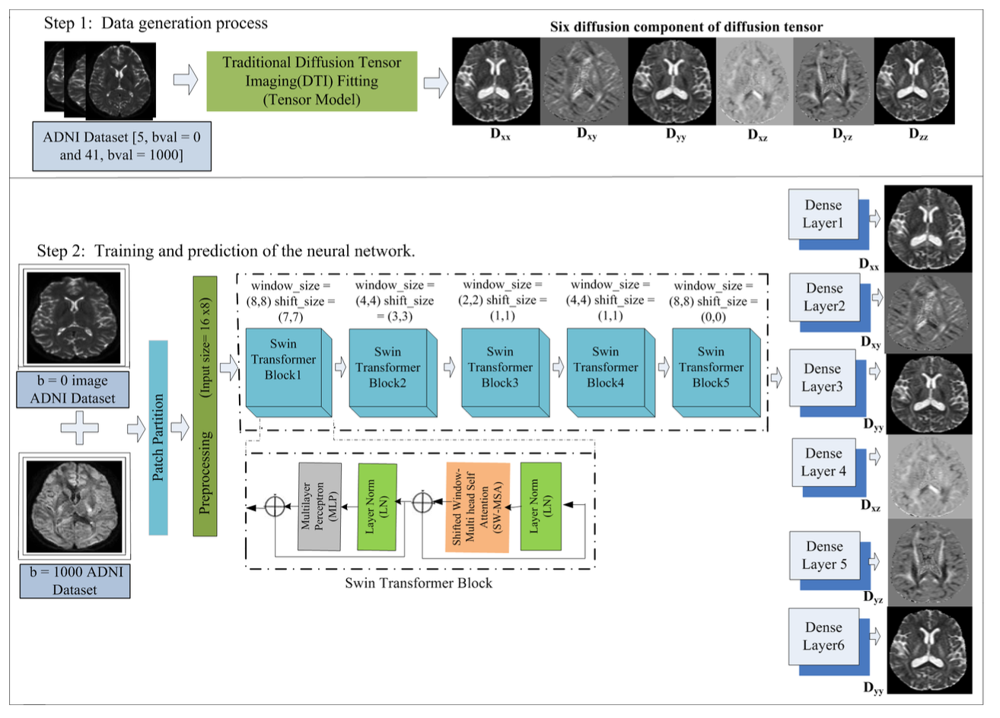

# Tract-based fast classification using sparse measurement for early detection of Alzheimer disease

# Abstract
The early detection of Alzheimer’s disease (AD) poses a significant challenge due to the heterogeneous information extracted from magnetic resonance imaging (MRI) and the time-consuming nature of full diffusion weighted imaging (DWI) measurements. This paper presents a deep learning-based framework utilizing sparse DWI measurements for fast tract-based classification, where tracts are generated using Deep learning based diffusion tensor imaging (DTI) parameters. It focuses on identifying Mild Cognitive Impairment (MCI), and Cognitively Normal (CN) individuals. We specifically target longitudinal changes along dif- ferent white matter (WM) fiber bundles, aiming to detect pathological alterations within these bundles using sparse DWI measurements. Our proposed classification method demonstrates comparable performance to dense full DWI measurements in early AD detection, while signifi- cantly reducing the time required for diffusion image acquisition. Ex- perimental results showcase the efficacy of our framework in accurately identifying MCI, which is a early stage of AD, and capturing subtle longitudinal changes along WM fiber bundles. This research highlights the potential of sparse measurement to facilitate a timely and accurate diagnosis of neurodegenerative diseases such as AD.

# Steps to set up the repository

1. Clone and cd to this repo.
2. This project uses Python 3.11 version. Run `python3 -m venv venv`.
3. If Windows:
     `.\venv\Scripts\activate`
    
   If Mac:
     `. venv/bin/activate`
5. Make the script.sh executable, run: `./script.sh`
6. Follow the steps under Dataset heading to setup the dataset.

# Dataset Description
Data used in preparation of this article were obtained from the Alzheimer’s Disease Neuroimaging Initiative (ADNI) database (https://adni.loni.usc.edu/).
Following is the Demographic details of ADNI Dataset

| Characteristics | Description | Number of subjects |
|---|---|---|
| Cohorts          | Controls     | 24                 |
|                 | EMCI/LMCI    | 34                 |
| Age group        | 50-59        | 1                  |
|                 | 60-69        | 16                 |
|                 | 70-79        | 36                 |
|                 | 80-89        | 12                 |
|                 | 90-99        | 1                  |

# SwinDTI model architecture 

