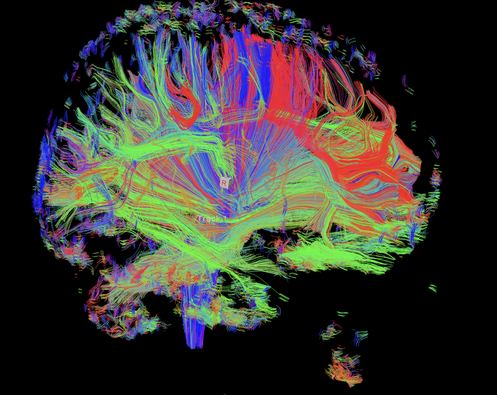

# Tract-based fast classification using sparse measurement for early detection of Alzheimer disease

# Abstract
The early detection of Alzheimer’s disease (AD) poses a significant challenge due to the heterogeneous information extracted from magnetic resonance imaging (MRI) and the time-consuming nature of full diffusion weighted imaging (DWI) measurements. This paper presents a deep learning-based framework utilizing sparse DWI measurements for fast tract-based classification, where tracts are generated using Deep learning based diffusion tensor imaging (DTI) parameters. It focuses on identifying Mild Cognitive Impairment (MCI), and Cognitively Normal (CN) individuals. We specifically target longitudinal changes along dif- ferent white matter (WM) fiber bundles, aiming to detect pathological alterations within these bundles using sparse DWI measurements. Our proposed classification method demonstrates comparable performance to dense full DWI measurements in early AD detection, while signifi- cantly reducing the time required for diffusion image acquisition. Ex- perimental results showcase the efficacy of our framework in accurately identifying MCI, which is a early stage of AD, and capturing subtle longitudinal changes along WM fiber bundles. This research highlights the potential of sparse measurement to facilitate a timely and accurate diagnosis of neurodegenerative diseases such as AD.

# Steps to set up the repository

1. Clone and cd to this repo.
2. This project uses Python 3.11 version. Run `python3 -m venv venv`.
3. If Windows:
     `.\venv\Scripts\activate`
    
   If Mac:
     `. venv/bin/activate`
5. Make the script.sh executable, run: `./script.sh`
6. Follow the steps under Dataset heading to setup the dataset.

# Dataset Description
Data used in preparation of this article were obtained from the Alzheimer’s Disease Neuroimaging Initiative (ADNI) database (https://adni.loni.usc.edu/).
Following is the Demographic details of ADNI Dataset

| Characteristics | Description | Number of subjects |
|---|---|---|
| Cohorts          | Controls     | 24                 |
|                 | EMCI/LMCI    | 34                 |
| Age group        | 50-59        | 1                  |
|                 | 60-69        | 16                 |
|                 | 70-79        | 36                 |
|                 | 80-89        | 12                 |
|                 | 90-99        | 1                  |

# SwinDTI model architecture 

For diffusion tensor estimation, we employed our recently proposed SwinDTI [model](https://proceedings.mlr.press/v222/tiwari24a/tiwari24a.pdf). This deep learning-based approach offers advantages over traditional methods by efficiently reconstructing high-quality diffusion tensors from DWI data acquired with a reduced number of diffusion directions, i.e., 21 diffusion directions and 5 diffusion directions.

Proposed feature selection approach for Tract-based rapid classification utilizing sparse measurements across 21 and 5 diffusion directions.
Following are the ROI regions: 

| Cluster-ID | Size (Voxels) | Regions |
|---|---|---|
| 5 | 12729 | Body of corpus callosum                         |
| 7 | 1362 | Corticospinal tract r                       |
| 8 | 1370 | Fornix                                       |
| 16 | 2278 | Anterior limb of internal capsule r           |
| 18 | 3018 | Cerebral peduncle r                          |
| 36 | 2751 | Cingulum                                   |
| 37 | 1238 | Cingulum                                   |
| 38 | 1155 | Cingulum                                   |
| 39 | 1124 | Cingulum                                   |

To extract diffusion metrics from specific white matter (WM) fiber bundles rele- vant to AD, we employed JHU label registration on the generated tractography.

# Results

We employed two k-fold cross-validation strategies: k-fold Decision Tree and k-fold Support Vector Machine (SVM) with radial basis function (RBF) kernel. 
The results of classification using 21diff and 5diff are as follows.

Classification scores on 21 diffusion directions:

| Classification Method | SwinDTI | Traditional | TransformerDTI |
|---|---|---|---|
| K-Fold Decision Tree | 91% | 64% | 64% |
| K-Fold SVM (rbf) | 91% | 73% | 64% |

Classification scores on 5 diffusion directions:

| Classification Method | SwinDTI | Traditional | TransformerDTI |
|---|---|---|---|
| K-Fold Decision Tree | 91% | 91% | 73% |
| K-Fold SVM (rbf) | 91% | 82% | 82% |

Since SwinDTI model produced highly accurate FA-AxD metrics for 21 and 5 diffusion directions, the classification performance demon- strates the effectiveness of SwinDTI in differentiating between healthy controls and AD patients, gaining insights into the specific brain regions contributing to this distinction is crucial. Hence, we employed feature importance analysis of the Decision Tree classifier and SVM classifier to identify the most informative Regions of Interest (ROIs).
The analysis revealed the top 3 most important features corresponding to the Cingulum, Corpus Callosum, and Corticospinal Spinal Tracts.

